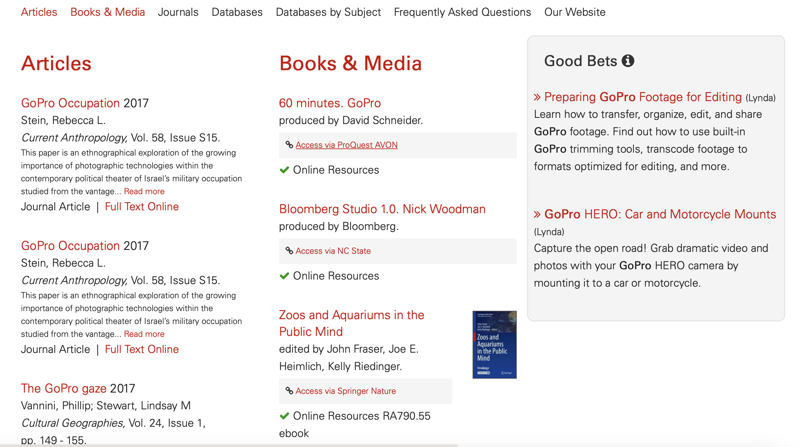

# Good Bets

## What is Good Bets?
Good Bets is a feature that will move bento results further up on the page as a third bento box. See attatched picture for an example. Good bets looks at the keyword and title fields and does a 75% match of searched terms to those fields. If the result is a 75% match it will consider the result a Good Bet. For example, if you search for "canon dslr camera rent". The only result you would get in the example is the first result because the words "canon", "dslr" and "camera" all appear in the title. The lack of the word "rent" creates a 75% match.



## How to setup Good Bets

1.  Go to your quicksearch_config.yml
2. Add the searchers you want to a field called `good_bets_searchers`. There you want to create a list similar to `searchers`. This list defines the searchers good bets will check the results for.
```
good_bets_searchers: [website, smart_subjects, ematrix_database, ematrix_journal, lynda]
```
3. Add page_type_mapping (optional). By default the page_type field will be set to the name of the searcher repo. For example, if you have a `ematrix_journal` searcher good bets will display `Ematrix Journal` next to the good bet result. This might not be particularly clear to the user. You can add specific mappings for each searcher if you are unhappy with the displayed text. Add the name of the searcher and the displayed text like below.

```
  page_type_mapping: {'lynda': 'LinkedIn Learning', 'ematrix_journal': 'Journals', 'ematrix_database': 'Databases'}
```